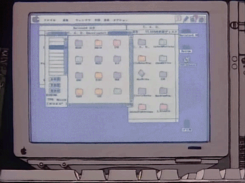

# Algorithm Study 😎



## 👉 1. What
Baekjoon, Programmers, Swea 등에서 Baekjoon 기준 from 실버 to 골드인 문제를 선별해서 풉니다. 


## 👉 2.  How
-`Pull Request` 자기 계정으로 해당 Repository fork 하기

- 각자 1문제 씩 추천하여 문제 선정
- 매주 최소 3문제씩 문제 풀이

## 👉 3. Convention
저희는 다음과 같은 Convention을 지키는 걸 지향합니다

### ✅  Code Convention
#### 코드 마다 이 코드는 **어떤 목적**으로 작성되었는지 주석을 답니다.
#### 변수와 함수 이름은 어떤 역할을 하는지 알 수 있도록 붙입니다.
#### code 마지막 줄에는 한 줄을 비웁니다. git add + git commit 하기 전에 확인해보는 걸 추천합니다.

    [왜?](https://github.com/ssafy-algoga/algorithm-study/pull/9#discussion_r564339257)

### ✅ Commit Convention
#### 한 번에 git add . 하는 것보다 commit type에 맞게 분리하는 걸 지향합니다.
```
docs : README.md 등 문서 작성 및 수정
code : 코드 작성
fix : 코드 수정
add : 기존에 푼 문제 대한 또 다른 솔루션 코드 추가
merge : 내 레포에서 올린 pull request를 현재 organization의 alogorithm-study 레포에 합치기
```
commit type 'code'인 경우 commit message에는 다음과 같은 정보를 명시하는 걸 지향합니다.
```bash
git commit -m "code : 자기이름 문제플랫폼 문제번호 문제유형 문제이름"  
```
예시는 다음과 같습니다.

곰팅이라는 사람이 있습니다. 곰팅이의 github ID는 gomting2입니다. 곰팅이는 백준에서 다이나믹 프로그래밍 유형인 1000번을 풀엇습니다.
우선 코드를 하나의 커밋으로 분리합니다.

```bash
git add answer.java
git commit -m "code : boj 1000"
```
코드에 대한 설명을 작성한 문서를 하나의 커밋으로 분리합니다. 
```bash
git add README.md
git commit -m "docs : boj 1000"
```

### ✅ Commit Convention
#### Commit 을 진행할 때는 자신의 branch에서 수행하고 추후에 master에 merge하는 과정을 지향합니다.
```bash
git switch -c "branch name"
(master) 👉 (branch name)
```


