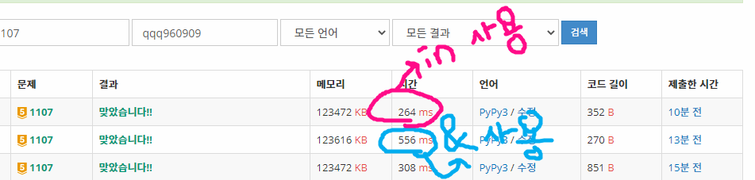

# 1107번_리모컨
[문제 보러가기](https://www.acmicpc.net/problem/1107)

## 🅰 코드

```python
# N: 목표로 하는 채널번호(0~500000), M: 고장난 버튼의 개수(0~10)
N = int(input())
M = int(input())
# button: 숫자 버튼 / 고장난 버튼이 있으면 빼준다
button = {i for i in range(10)}
if M != 0:
    button -= set(map(int, input().split()))

# 100번에서 N번으로 +, - 버튼만 쓴 경우
cnt = abs(100 - N)
# 50만 채널인데 최악의 경우를 고려할 때
# 작은수에서 +만 사용(50만)에 큰수에서 -만 사용(50만)을 더하면 100만 가지의 경우의 수가 발생
for i in range(1000000):
    flag = True
    for j in str(i):
        if int(j) not in button:
            flag = False
            break
    if flag:
        # button으로 접근 할 수 있는 수에다가 목표 채널의 차이(+, - 으로 이동)를 더한 값
        cnt = min(cnt, len(str(i)) + abs(N-i))

print(cnt)

```

## 🅰 &연산자 사용

```python
n = int(sys.stdin.readline())
m = int(sys.stdin.readline())
li = set(list(sys.stdin.readline().split()))
res = abs(100-n)
for i in range(1000000):
    ba = set(list(str(i)))
    le = len(str(i))
    if not ba&li:
        res = min(res,le+abs(n-i))
print(res)

```

---


## ✅ 후기
* 문제를 보는 순간 별 생각 없이 `brute force`로 풀면 되겠지라는 생각을 가지고 문제에 주어진 대로 최대 채널 수 만큼 `500000`까지로 설계해 주었다. 그러나 `맞았습니다!!`라는 문구는 보이지 않았고 고민 끝에 `1000000`으로 설계해줘야 한다는 사실을 깨달았다!!
* 우여곡절 끝에 문제를 해결하고 다른 사람들은 어떻게 풀었는지 살펴보는 와중 `&`연산자를 이용해 비교적 짧게 구현된 코드를 발견하게 되었다. 결과가 어떻게 나올지 궁금하여 두개를 돌려보았는데 다음과 같이 나왔다.



* `산술연산자`와 `비트연산자`에서는 `비트연산자`의 속도가 월등히 빠른 걸로 알고 있는데 이 경우에서는 반대의 결과가 나와서 신기했다. 물론 난 아직 이런 연산자를 쓰는 것이 익숙치 못해 이해도 어렵지만, 나중에는 자유롭게 구사하는 날이 오기를...