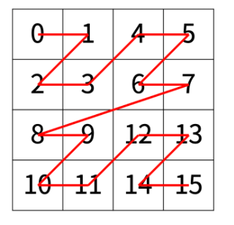
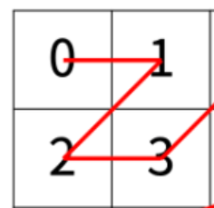

# 1074번 Z
[문제 보러가기](https://www.acmicpc.net/problem/1074)

## 🅰 설계

1. 4등분 할 때 Z의 시작값이 어떻게 달라지는지 확인

   

   1 -> 4 -> 8 -> 12

   `2 ** (2*N-2)`만큼씩 더해진다. 

2.  `2 ** (2*N-2)`만큼 더한 이후에는 잘라진 후의 첫번째 사각형의 각 위치의 값만큼 더해주면 된다.

   4 = 4 + 0

   5 = 4 + 1

   6 = 4 + 2

   7 = 4 + 3

   

   따라서 r, c를 첫번 째 사각형의 각 위치로 조정해준다.

   ```python
   N, r, c = map(int, input().split()) # 2^N 한 변의 길이
   
   
   def order(N, r, c):
       if N == 0:
           return 0
       if r < 2**(N-1) and c < 2**(N-1):
           return order(N-1, r, c)
       elif r < 2**(N-1) and c >= 2**(N-1):
           return 2**(2*N-2) + order(N-1, r, c-2**(N-1))
       elif r >= 2**(N-1) and c < 2**(N-1):
           return 2*2**(2*N-2) + order(N-1, r-2**(N-1), c)
       elif r >= 2**(N-1) and c >= 2**(N-1):
           return 3*2**(2*N-2) + order(N-1, r-2**(N-1), c-2**(N-1))
      
   print(order(N, r, c))
   ```

   


## ✅ 후기
어렵게 생각하기 보다는 각각의 값이 어떤 규칙으로 바뀌는지를 파악하고

그 하나씩 적용해나가는 게 분할정복을 푸는 방법인 것같다.

처음에 어떻게 값이 나오는지 알 수 없어서

for문을 활용해서 전체 값을 출력해서 값의 변화를 한눈에 살펴보니까 어디가 잘 못되었는지 알 수 있어서 도움이 되었다.