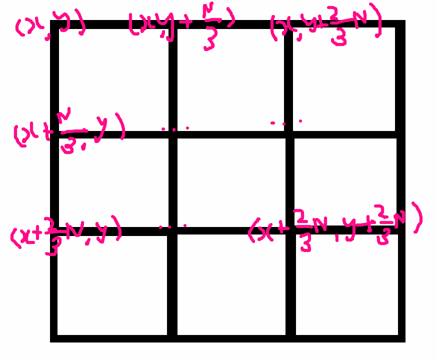

# 1780번 종이의 개수
[문제 보러가기](https://www.acmicpc.net/problem/1780)

## 🅰 코드

```python
import sys

N = int(sys.stdin.readline())
data = []
for _ in range(N):
    data.append(list(map(int, sys.stdin.readline().split())))

result = {"-1": 0, "0": 0, "1": 0}

# 체크 함수
def check(row, col, N):
    value = data[row][col]
    for i in range(N):
        for j in range(N):
            if value != data[row + i][col + j]:
                # 9분할
                check(row, col, N // 3)
                check(row, col + N // 3, N // 3)
                check(row, col + N * 2 // 3, N // 3)
                check(row + N // 3, col, N // 3)
                check(row + N // 3, col + N // 3, N // 3)
                check(row + N // 3, col + N * 2 // 3, N // 3)
                check(row + N * 2 // 3, col, N // 3)
                check(row + N * 2 // 3, col + N // 3, N // 3)
                check(row + N * 2 // 3, col + N * 2 // 3, N // 3)
                return
    result[str(value)] += 1

check(0, 0, N)
# 결과 출력
print(result["-1"])
print(result["0"])
print(result["1"])

```

---


## ✅ 후기
* 전에 풀어보았던 색종이 문제와 유사했다. 그때는 4분할 이었지만 지금은 9분할이라는 차이가 있을뿐?..
* 그림으로 좌표를 찍어내면 다음과 같다.



* 단지 좀 귀찮았던 것은 분할하는 과정을 계속 반복해줬는데 이걸 한번에 처리할 방법이 없는지 고민이 되었다...💦